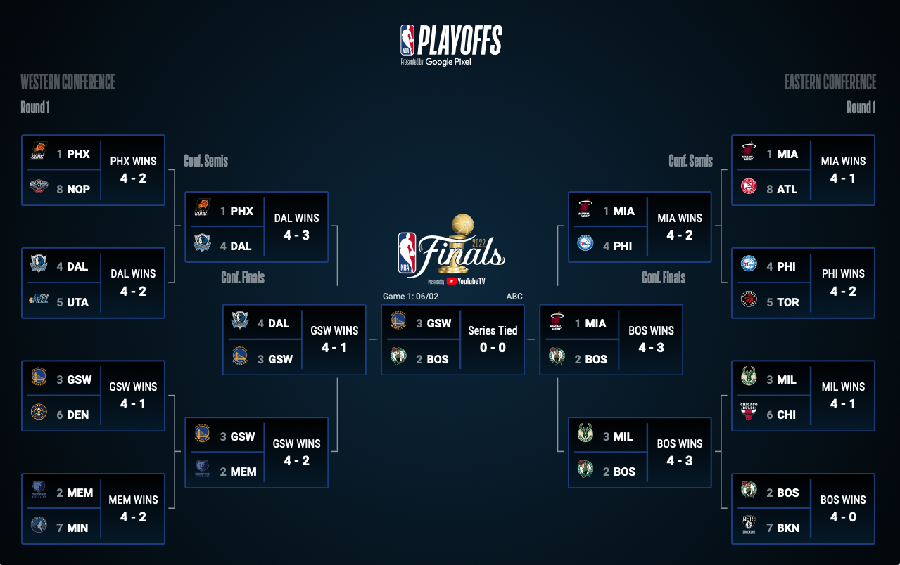

# Team number: 3_CPS 

## NBA league

- There are 30 teams in the NBA league and they are divided into East and West Conference (15 teams on each)

- Each team will play 82 matches in total throughout the entire season

- The top 8 teams from each conference will advance to the playoff according to their win-lose record (the picture below shows the playoff tree)

- Each series will be held in the form of best of 7

Team member:
- Toh Jin Hung  306075
- Adam Witczak  306078